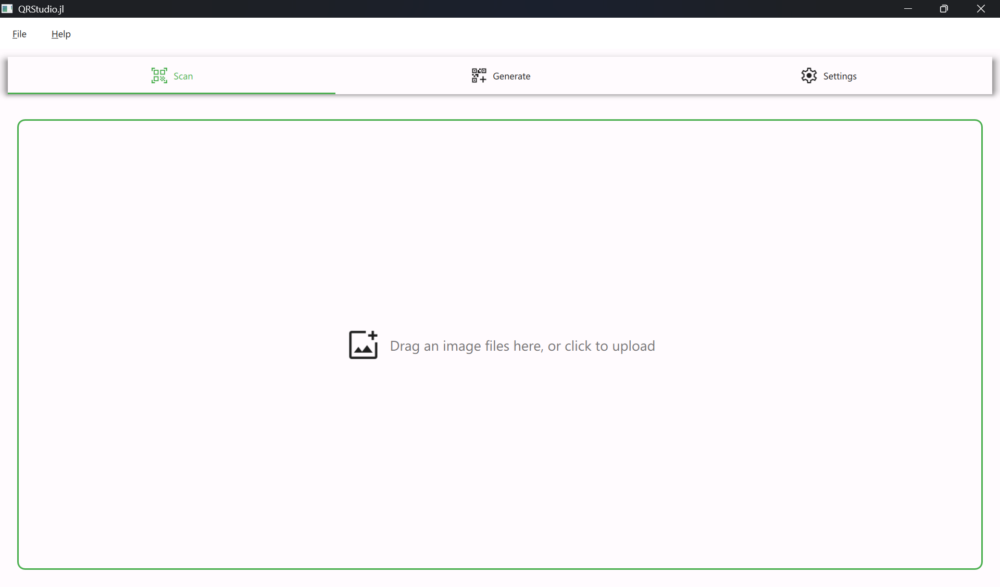
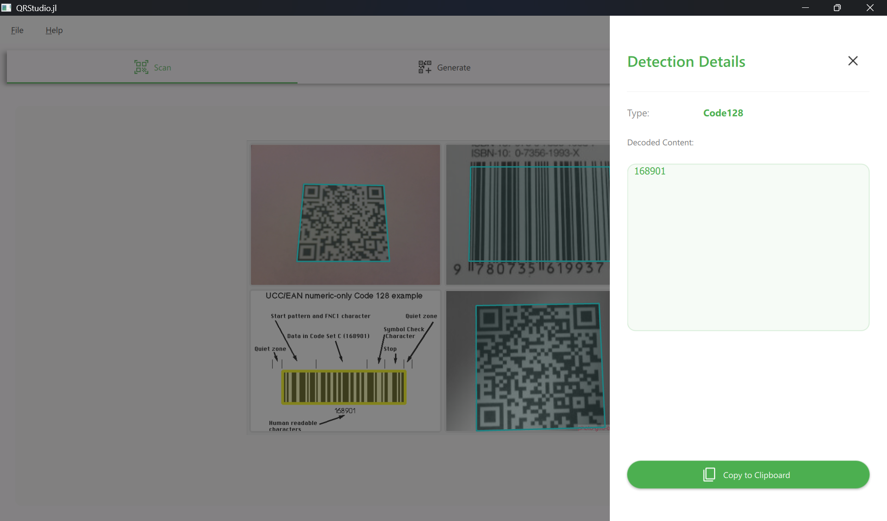
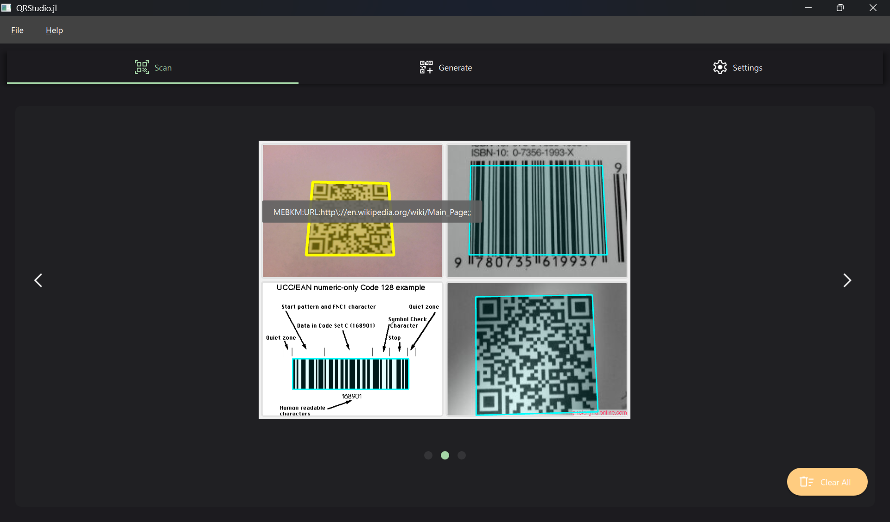
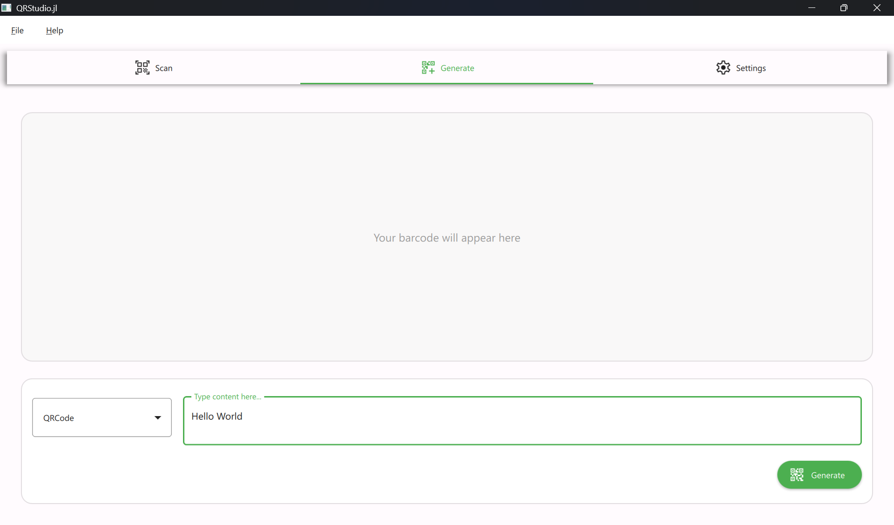
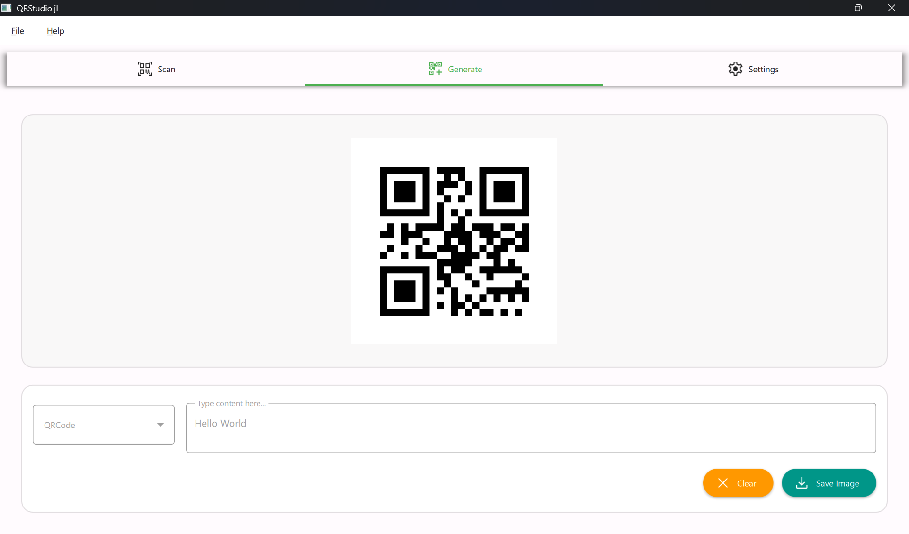
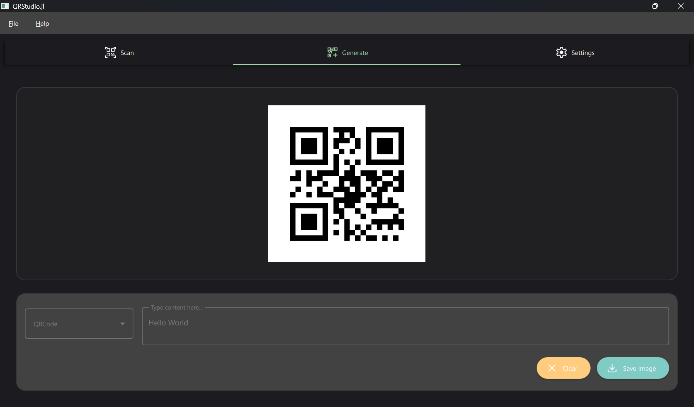
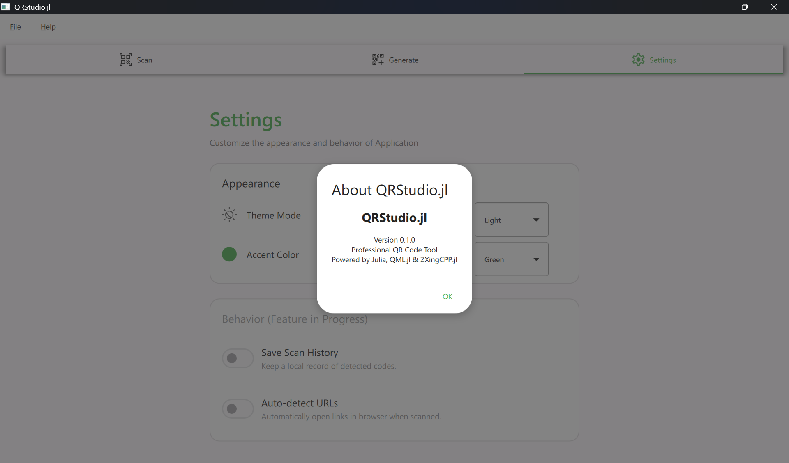
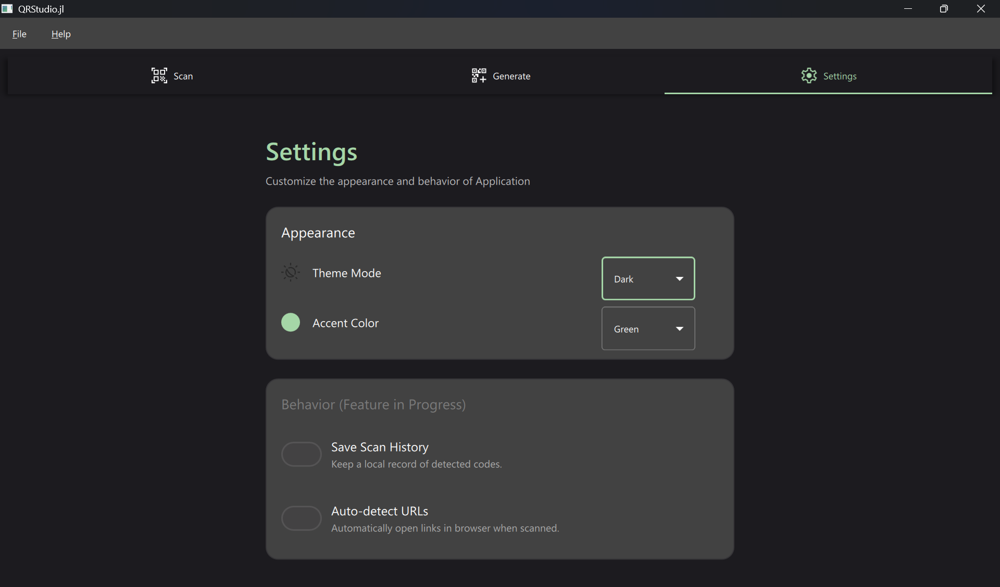

# QRStudio.jl

## Overview
QRStudio.jl is a cross-platform desktop application for Barcode and QR code processing, providing a unified interface for detection, visualization, and generation workflows. Built in Julia and leveraging QML.jl for its graphical interface and ZXingCPP.jl for barcode generation and decoding.

## Previews










## Features
- Simultaneous analysis of multiple image files via a drag-and-drop and file upload interfaces.
- Support for over 20+ formats including QRCode, Aztec, DataMatrix, Code39 and
Code128.
- Real-time polygon overlays that precisely map detected barcodes within their original image context.
- On-hover tooltips for quick data previews and a side-drawer for inspection of detected content.
- Integrated clipboard feature for copy detected data.
- User-selectable Material Design accents and dedicated Dark/Light modes to match system preferences.

## Getting Started

1.  **Ingestion**: Drag images into the Scan view or select files manually.
2.  **Detection**: Hover over highlighted regions to see decoded data or click for details.
3.  **Creation**: Use the Generate view to turn text content into standard barcode formats.
4.  **Export**: Save generated codes or copy scanned text to the clipboard.

## Setup
Run following from Julia REPL
```julia
using Pkg
Pkg.Apps.add("QRStudio")
```

Launch application via terminal
```
QRStudio
```
